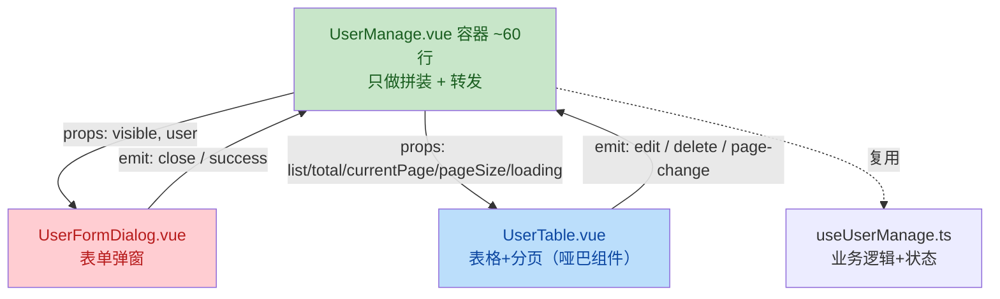

# 前端工程化迁移实录：从可运行 Demo 到中型工程

> 项目：用户管理系统（Vue 3 + TypeScript + Element Plus + Pinia + ECharts）
> 周期：六个阶段 ｜ 方法：每阶段只动一层，动完即验证
> 定位：换新项目时可照抄的迁移方法论 + 本次踩坑实录

---

## 一、迁移前的样子（为什么要迁）

| 维度 | 迁移前 | 迁移后 |
|---|---|---|
| 类型 | 纯 JS，字段拼错运行时才发现 | types/ 目录统一说明书，编译期报错 |
| API 层 | url 散在组件里，响应结构靠记忆 | api/*.ts 统一签名，`BizResult<T>` 泛型解包 |
| 业务逻辑 | 全部堆在 UserManage.vue（326 行） | 逻辑进 composable，展示进子组件 |
| 组件 | 单文件既查数据又弹窗又渲染表格 | 容器(~60行) + UserTable + UserFormDialog |
| 图表 | — | Dashboard 独立路由 + 懒加载 + 内存零泄漏 |

核心痛点一句话：**改一处不知道会崩几处**——因为没有类型契约、没有职责边界。

---

## 二、迁移总路线（六步法）


**为什么是这个顺序**：类型层是地基（后写谁都要引用它）→ API 层是数据入口（先保证进来的数据可信）→ 再往上才是状态、逻辑、视图。**自底向上，每层只依赖已经修好的层。**

---

## 三、各阶段实录

### 阶段 1：类型层（src/types/）——写"说明书"

**思想**：TS 不是新语言，是给 JS 加的"字段说明书"。编译器读说明书做检查，运行时说明书会被完全擦除。

```ts
// types/user.ts —— 前后端的数据契约
export interface UserVO {            // VO：后端返回给我的用户样子
    id: number
    username: string
    role: 'admin' | 'user'           // 字面量联合：只许这两个值
    status: 0 | 1
    createdAt: string                // 后端格式化成 "2026-08-01" 字符串
}

export interface RegisterDTO {       // DTO：我提交给后端的新增表单料
    username: string
    password: string
    email: string
    name: string
}

export interface UpdateUserDTO {     // 全部可选：改哪项传哪项
    name?: string
    email?: string
    role?: 'admin' | 'user'
    status?: 0 | 1
}
```

```ts
// types/api.ts —— 两个万能泛型信封
export interface BizResult<T> { code: number; message: string; data: T }
export interface PageData<T> { list: T[]; total: number }
```

**命名规范**：`*VO`（后端→前端）、`*DTO`（前端→后端）。VO 只读，DTO 提交，**不混用**——更新接口不许传 username 就在 UpdateUserDTO 里根本不写它，让编译器替后端把关。

### 阶段 2：API 层类型化（src/api/user.ts）

```ts
export const getUserById = async (id: number): Promise<BizResult<UserVO>> =>
    await instance.request({ url: `/api/users/${id}`, method: 'get' })
```

- 每个函数标注**入参类型 + 返回泛型**，调用处自动获得完整提示
- ⚠️ 踩坑：GET 请求参数写进了 `data`，后端收不到 → **GET 用 `params`，POST 用 `data`**，一次记住

### 阶段 3：Dashboard 图表页

- 路由懒加载：`component: () => import('@/views/Dashboard.vue')` + `meta: { requestAdmin: true }` 权限守卫
- ECharts 三件套，**缺一就是内存泄漏**：
  1. `onMounted` 初始化 + `window.addEventListener('resize', handleResize)`
  2. 窗口变化时 `chart.resize()`
  3. `onUnmounted` 里 `removeEventListener` + `chart.dispose()` + 置 null
- ⚠️ 踩坑：`setTimeout` 在浏览器返回 `number`、Node 返回 `Timeout` → 计时器统一写 `ReturnType<typeof setTimeout>`

### 阶段 4：Pinia store TS 化

```ts
function updateUserInfo(partial: Partial<UserVO>) {
    userInfo.value = { ...userInfo.value, ...partial }
}
```

`Partial<UserVO>` = "UserVO 的所有字段都变成可选"。局部更新只传变化项，不用每次拼完整对象。

### 阶段 5：逻辑抽离 useUserManage.ts

搬走：列表加载、搜索（防抖）、分页、删除（含"不能删自己"校验 + confirm）。
留下：`dialogVisible` 供容器控制弹窗开关。

**口诀：调接口、弹消息、做判断的 = 业务 = 进 composable；纯渲染 = 留组件。**

⚠️ 踩坑：composable 忘写 `return` → 组件里解构全是 undefined；`handleCurrentChange` 声明两遍 → 重名报错。

### 阶段 6：组件拆分合体



**关键设计**：

- 原来的 `handleAdd`/`handleEdit`（清空表单/抄行数据）**没有搬进容器**，而是变成两句话：`editingUser.value = null | user` + 开窗。填表/清空由 UserFormDialog 内部 `watch(() => props.user)` 自动完成——父只传"意图"，子自己响应，这就是**单向数据流**。
- 子组件 emit 的 payload 按**位置**传给父的回调，回调形参名叫什么无所谓，事件名才是契约。

---

## 四、踩坑实录（bug → 根因 → 解药）

| # | 症状 | 根因 | 解药 |
|---|---|---|---|
| 1 | `role?: xxx` 直接语法红线 | `?` 只能写在 interface，对象字面量里非法 | 删 `?`；可选性是"说明书"的概念 |
| 2 | `status` 报 `number 不能赋给 0\|1` | ref 里字面量被**放大**：`'user'`→string、`1`→number | `ref<RegisterDTO & UpdateUserDTO>({...})` 显式钉死类型 |
| 3 | "Element is missing end tag" 行号乱飘 | 属性双引号没闭合，编译器从断点处连环误判 | 从报错行向上找未闭合的 `"` |
| 4 | 表格永远空白 | `:data="List"` 大小写与 props `list` 不一致 | props 名严格区分大小写 |
| 5 | `scope is not defined` 白屏 | 换了 `#default="{ row }"` 还写 `scope.row` | 解构出什么就用什么 |
| 6 | 分页器不显示 | `:page-size="page"`（props 叫 pageSize） | 绑定名必须与 props 精确一致 |
| 7 | GET 参数后端收不到 | 参数写在 `data` | GET→`params`，POST→`data` |
| 8 | 图表内存泄漏 | 只 init 不 dispose | onUnmounted 三连：移除监听+dispose+置null |
| 9 | composable 解构全 undefined | 忘写 return | return 状态+方法清单 |
| 10 | `res.list` undefined | 响应外面包着 `BizResult` | 先 `res.data` 再取字段 |

**规律**：一半是"契约对不齐"（大小写、命名、结构），一半是"TS 概念没建立"（字面量放大、`?` 的归属）。契约类靠**对照 props/emit 清单自测**，概念类靠**理解一次终身免疫**。

---

## 五、最终完成标准（验收清单）

- [x] types/ 三层齐全：VO / DTO / 泛型信封（BizResult、PageData）
- [x] api/ 全函数有入参+返回类型标注
- [x] Dashboard 懒加载 + 图表生命周期完整
- [x] store 用 Partial 支持局部更新
- [x] UserManage.vue ≤ 60 行，template 无 el-table/el-dialog/el-form
- [x] UserTable/UserFormDialog 全 props+emit 有类型契约
- [x] 红线清零，增删改查全链路可跑

---

## 六、遗留事项（下次升级方向）

1. **项目缺 tsconfig.json**（目前只有 jsconfig.json），TS 跑在宽松模式。开启 `strict: true` 后会暴露两颗"将来雷"：
   - `updateUser(editId.value, ...)` 的 editId 是 `number | null` → 用**非空断言** `editId.value!`
   - 已提前布防：`formRef = ref<FormInstance>()`
2. router/index.js 还是 JS，可 TS 化
3. main.js、request.ts 周边文件可统一迁移
4. 可补充 Vitest 单测，给 useUserManage 上保险
